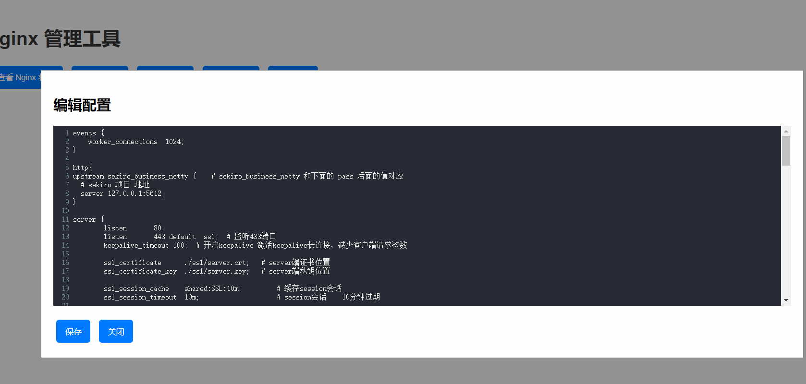

## 说明

​	毫无安全性可言，只适合本地使用，无性能追求，只求可用，哈哈。

​	脚本运行后，会请求**管理员权限**，用于注册服务和安装证书功能, 会尝试安装缺失的第三方python库。同时服务注册后是自启动的，想要手动，改一下代码，我懒得改了哈哈，扔虚拟机吧

​	官方的免费sekiro-demo没有找到UI界面，对于 wss 还需要 nginx 或其他中间件来支持 wss。通过 `Flask` 来实现Nginx 使用的 https 证书的安装管理 ，Nginx  和  Sekiro-demo 的开启关闭，以及配置文件。Web 调用 `Sekiro` 的 API 来进行查询。

​	管理Nginx 是通过 `WinSW.exe` 注册服务来实现，我改名为 `nginx_service.exe` 管理 Sekiro通过 `nssm.exe` 来注册服务实现, 我改名为 `sekiro_service.exe`

​	启动后，注册系统服务，名称 `Sekiro Service` 和 `Nginx Service for Sekiro` ，若想卸载服务可以单独运行 `util/installservice.py`

- `Nginx` 会监听 80 和 443 
- `Sekiro` 会监听 5612
-  Flask 本身 `5000` 端口

首页 :  http://127.0.0.1:5000/

## 运行环境：

- windows10-64位- （不支持 Linux，window11未知）
- python3.8.10 其他版本未知

## 一、证书安装管理模块 - 为sekiro wss 支持

- 添加域名， 首次勾选安装证书，否则后面 wss 无法正常使用

 

 

- 证书生成后在 `nginx下的 ssl`下

   

## 二、Nginx模块 - 为 sekiro 提供 wss 支持 

 

#### (一) 、查看状态

 

#### （二)、启动Nginx 

 

 

#### (四)、关闭Nginx

 

 

####  (五)、重启 

 

#### (六)、编辑配置

- 默认监听 80 和 443 端口， 443 为 https，修改配置后，请重启 Nginx

 

##  三、Sekiro 模块 

#### (一)、 管理 Sekiro 模块，同Nginx，

 

- 配置官方提示仅支持 一条修改端口，修改后请重启

  

#### (二)、快速生成油猴脚本模块 - 注意不要在测试版本谷歌中使用，油猴脚本不生效 

- 选择协议，填写组名称

 

- 这里可以新填写自定义的脚本

 

- 复制代码

 

#### (三)、创建油猴脚本粘贴，启用改脚本

 

 

## 四、查看 调用API 模块

#### (一)、 查看注册的group

 

#### (二)、查询对应组的

 

#### (三)、查询对应的值

​    

 

